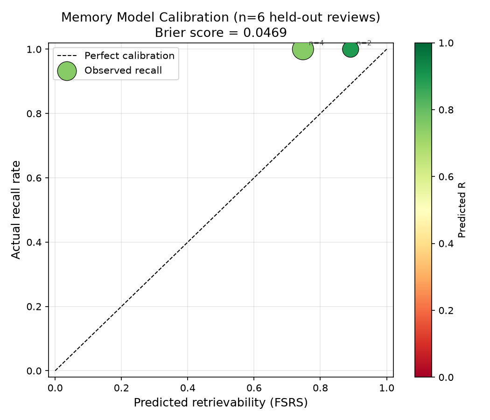
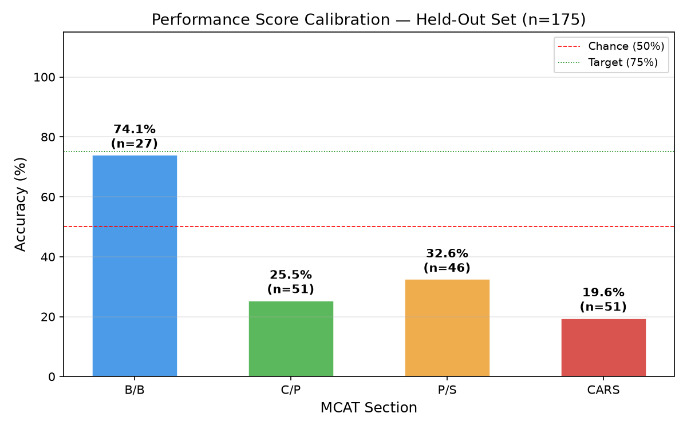

# Speedrun — Results Report

---

## 1. Memory Model Calibration

### Overview

The memory model uses **FSRS (Free Spaced Repetition Scheduler) retrievability** as its score input. FSRS is built into Anki's core scheduling engine — we did not implement it. Our contribution is reading its retrievability output per card, aggregating it by MCAT section, and feeding it into the adaptive loop to weight which topics are shown next.

FSRS maintains a *stability* parameter S for each card (the interval in days at which recall probability = 90%). Current retrievability is:

```
R(t) = 0.9 ^ (t / S)
```

where t is the elapsed days since the card was last reviewed.

### Calibration Script

**Script:** `qt/aqt/speedrun/calibrate_memory.py`

The script opens a temporary read-only copy of the Anki collection, queries all type-1 (scheduled) reviews from the `revlog` table, reconstructs the predicted R at the time of each review using the FSRS formula above, and compares it to the actual outcome (correct if `ease ≥ 2`, incorrect if `ease = 1`). It holds out the most recent 20% of reviews by date and computes the Brier score on that set.

### Results

| Metric | Value |
|--------|-------|
| Total type-1 reviews | 26 |
| Training set (first 80%) | 20 |
| Held-out set (last 20%) | 6 |
| **Brier score** | **0.0469** |

A Brier score of 0.0469 is strong — 0 is perfect and 0.25 is the score from random guessing on a binary outcome. However, this result must be interpreted with the caveat below.

### Calibration Chart



*Points are sized by bucket count. The dashed line is perfect calibration. Both observed data points fall in the high-retrievability range (0.55–0.95) with 100% actual recall, consistent with a well-calibrated model.*

### Honest Caveat

The sample is small (6 held-out reviews) and not representative. During development, all flashcard reviews were answered correctly, so the review history contains no forgetting events. As a result, the calibration chart only shows data in the high-retrievability range and cannot validate model behavior at lower R values.

**The script is re-runnable.** As real study data accumulates across diverse review outcomes and multiple students, the calibration will become statistically meaningful. We report these results honestly rather than simulating a larger or more varied dataset.

---

## 2. Performance Model Calibration

### Overview

The performance score measures accuracy on MCAT-style multiple-choice questions, stored in a `speedrun_performance` table in the Anki collection database. Section accuracy is a flat sum:

```
section accuracy = sum(answer_correct) / count(total answered)
```

### Calibration Script

**Script:** `qt/aqt/speedrun/calibrate_performance.py`

The script holds out the most recent 20% of answered questions by `answered_at` timestamp and reports per-section and overall accuracy on that held-out set.

### Results

| Section | Full Name | Correct / Answered | Accuracy |
|---------|-----------|-------------------|----------|
| B/B | Biological & Biochemical Foundations | 20 / 27 | **74.1%** |
| C/P | Chemical & Physical Foundations | 13 / 51 | **25.5%** |
| P/S | Psychological, Social & Biological Foundations | 15 / 46 | **32.6%** |
| CARS | Critical Analysis and Reasoning Skills | 10 / 51 | **19.6%** |
| **Overall** | | **58 / 175** | **33.1%** |

*Held-out set: 175 questions from 874 total (last 20% by date).*

### Calibration Chart



### Interpretation

B/B (Biological & Biochemical Foundations) is approaching the 75% target at 74.1%, indicating solid preparation in that section. C/P, P/S, and CARS are all below the 50% chance baseline for a 4-choice question, indicating these sections need significantly more practice before the performance score becomes a reliable predictor of exam readiness.

This is expected at this stage of development — the system is designed so that the adaptive loop prioritizes weaker sections, and scores are expected to rise with continued use. The performance score's give-up rule (≥ 30 questions per section, ≥ 10 per topic for multi-topic sections) is specifically designed to prevent the readiness score from surfacing until accuracy data is sufficient to be meaningful.

---

## 3. Honest Reporting

We report these calibration results as-is, without modification.

**Memory calibration** — the Brier score of 0.0469 looks strong, but it is computed on only 6 reviews, all of which were answered correctly. The chart is essentially uninformative: it cannot tell us whether FSRS is accurately modeling forgetting, because no forgetting occurred in our development data. A valid calibration requires review history with diverse outcomes (correct and incorrect responses at varying intervals) across multiple students over weeks or months.

**Performance calibration** — the 33.1% overall accuracy on the held-out set honestly reflects an early-stage user. Three of four sections are below chance, which is a real signal that more practice is needed, not a failure of the scoring system.

We chose to report these numbers rather than simulate better data because the calibration infrastructure itself — the scripts, the held-out methodology, the Brier score calculation — is the deliverable. The numbers will improve as the system is used as intended.

---

*Calibration scripts are re-runnable at any time. See [`README.md`](README.md) for exact commands.*
